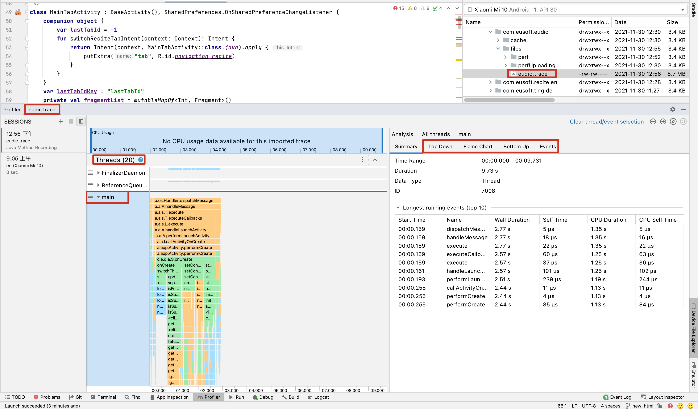
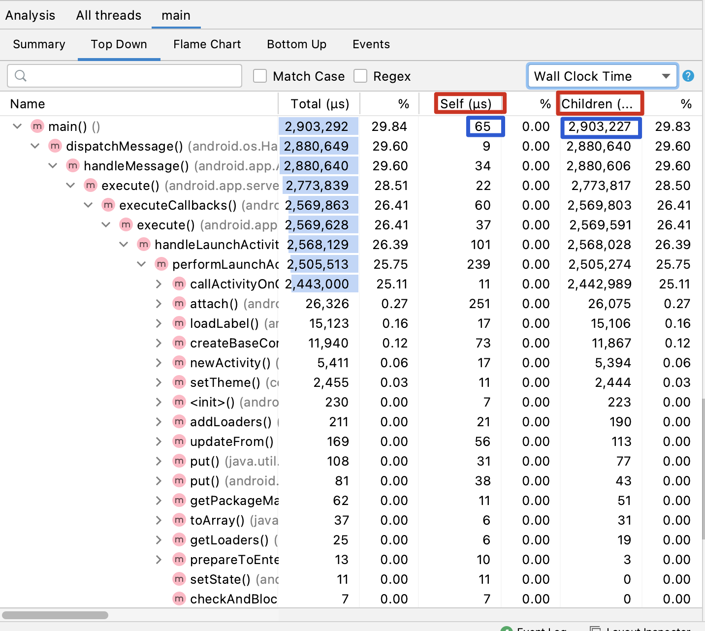
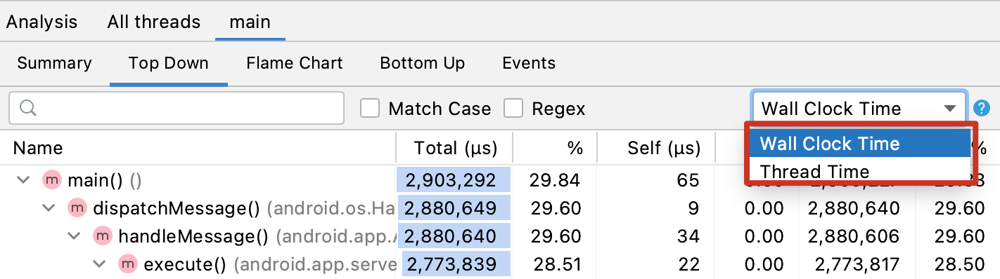
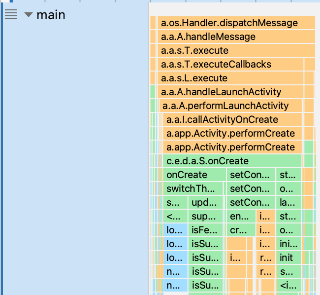

## 3-4 启动优化工具选择 - traceview

- traceview
- systrace

两种方式互相补充。


### traceview

- 图形的形式展示执行时间、调用栈
- 信息全面，包含所有线程
- 允许开销严重，整体都会变慢
- 可能会带偏优化方向。

#### 使用方式

-  代码：

  ```java
  // 开始
  Debug.startMethodTracing("");
  
  // 结束，会生成一个文件, 路径：sdcard 卡中 Android/data/包名/files
  Debug.stopMethodTracing();
  ```

- 双击打开文件，如图：

  

#### 工具说明

- Self 和 Children
  - self 是调用了一行代码执行的时间
  - 后面的 Children，是调用了那一行代码（方法），具体的执行时间




- Wall Clock Time 和 Thread Time
  - Wall Clock Time：程序执行时间，这个线程的执行时间。
  - Thread Time：CPU 真正执行的时间




- 颜色说明：
  - 橙色：系统 API 调用
  - 绿色：应用自身 API
  - 蓝色：第三方 API




