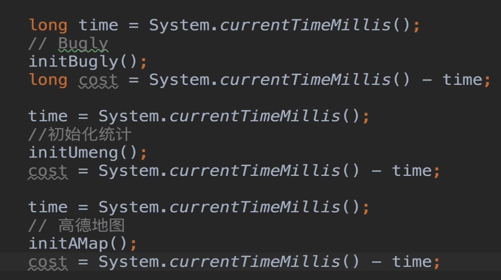

## 3-6 优雅获取方法耗时

- 常规方式
- AOP ：推荐

---

### 常规方式

- 背景：需要知道启动阶段所有方法耗时

- 方式：

  - 手动埋点

    ```java
    long start = System.currentTimeMillis()
    
    // 或者
    SystemClock.currentThreadTimeMills()
    ```

    如图：

    

  缺点：

  - 和正常的代码耦合太严重
  - 侵入性强
  - 工作量大

---

### AOP

Aspect Oriented Programming ，面向切面编程。

- 针对同一类问题的统一处理

- 无侵入添加代码

- AspectJ 使用(视频 06:45 )：

  - 用来辅助实现 AOP

    ```
    // classpath
    
    
    // implementation
    
    // apply plugin
    
    ```

#### AspectJ 

##### 知识点：

- **Join Points:** 程序运行时的执行点，可以作为切面的地方
  - 函数调用、执行
  - 获取、设置变量
  - 类初始化
- **PointCut:** 带条件的 Join Points
- **Advice**: 一种 Hook，要插入代码的位置
  - Before
  - After
  - Around: PointCut 之前、之后哦分别执行

##### 语法简介

```java
@Before("execution(* android.app.Activity.on**(..))")
public void onActivityCalled(JoinPoint joinPoint) throws Throwable {
		...
}
```

- Before: Advice，具体插入位置
- Execution: 处理 Join Point 的类型，call、execution
- (* android.app.Activity.on**(..))： 匹配规则
- onActivityCalled： 要插入的代码

