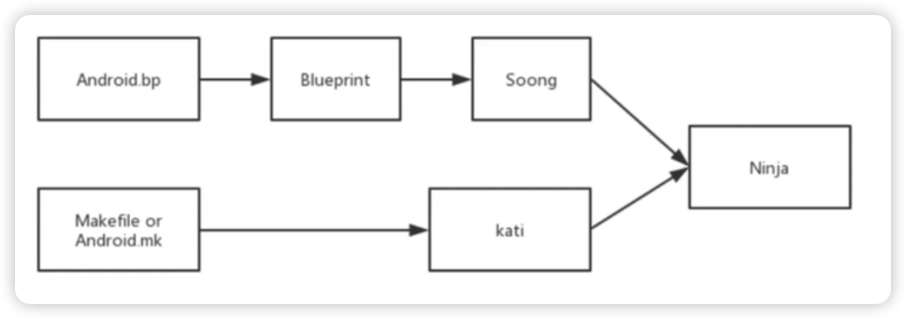

## Android 系统的整编和单编

下载完 AOSP 后不仅可以查看源码，还可以做更多有趣的事情：

- 定制 Android 系统
- 将最新版本的 Android 系统刷入到自己的 Android 设备中
- 将整个系统源码倒入到 Android studio
  - 不一定要全部源码才行，有对应 Android 源码版本的 android.iml 和 android.ipr 两个文件就可
- 动态调试 Android 系统源码
  - 不一定要全部源码才行，导入部分源码可以

### 源码编译相关知识了解

- Makefile
- Android.mk
- Ninja
- Soong
- Blueprint
- Kati
- 
#### Ninja

- 小型编译系统
- 用汇编写的
- 编译速度快

#### Soong

- Google 用来替代的 Makefile

#### Blueprint

把 android.bp 文件翻译成 Ninja 语法的

#### Kati

- Google 专门为 Android 开发的小型项目，基于 golong 和 C++
- 目的是把 Makefile 转为 Ninja 文件

#### 关系示意图



### Android 系统源码编译有多种方式

- 在 Linux 中直接进行系统源码编译（Android 官方支持）
- 在 Mac OS 中直接进行系统源码编译（Android 官方支持）
- 使用 Docker 编译，支持 Mac OS 和 Windows

### Linux（Ubuntu）下编译介绍

- [环境配置](#环境配置)
- [整编开始](#整编)
- [单编](#单编)

#### 环境配置
- 设置虚拟机(Ubuntu)处理器
  - 虚拟机情况
- 安装 jdk
  - ``sudo apt-get install openjdk-8-jdk``
- 安装依赖包：
  - ``sudo apt-get install git-core gnupg flex bison gperf build-essential zip curl zlib1g-dev gcc-multilib g++-multilib libc6-dev-i386 lib32ncurses5-dev x11proto-core-dev libx11-dev lib32z-dev ccache libgl1-mesa-dev libxml2-utils xsltproc unzip``

#### 整编

- 进入 aosp 目录
  - 初始化环境
    - ```shell
       source build/envsetup.sh
      
       // 编译前删除 build文件夹
       make clobber
      ```
- 选择编译目标
  - ``lunch``
  - 会列出多个目标
    - 输入目标名称或者序号都可
- 编译：``make -j6``

[可能会报错，缺少一些库，安装即可。](./error/compile_error.md)

编译完成后，在 `out/target/product/generic_x86/` 目录生成三个重要的镜像文件：**system.img**、**userdata.img**、**ramdisk.img** 

- system.img
  - 系统镜像
  - 包含 Android 系统主要的目录和文件
  - 通过 init.c 进行解析并 mount 挂在到 /system 目录下
- userdata.img
  - 用户镜像
  - 是 Android 系统中存放用户数据的
  - 通过 init.c 进行解析并 mount 挂载到 /data 目录下
- ramdisk.img
  - 根文件系统镜像
  - 包含一些启动 Android 系统的重要文件，比如 init.rc 

---

#### 单编
比如编译：Settings
- ``cd aosp``
- ``source build/envsetup.sh``
- ``lunch aosp_x86-eng``
- ``cd packages/apps/Settings``
- ``mm``
  - 编译当前目录下的模块

##### 完成后

- 会生成 Settings.odex 文件
  - 在目录：``out/target/product/generic_x86/system/priv-app/Settings/ota/x86`` 下
- 会生成 Settings.apk
  - 在目录：``out/target/product/generic_x86/system/priv-app/Settings`` 下

##### 其他单编方式

- mmm: 编译指定目录下的模块，不编译它所依赖的其他模块
- mma: 编译当前目录下的模块及其依赖项
- mmma: 编译指定路径下的所有模块，并且包含依赖

### 最后

[皇叔的技术博客文章](http://liuwangshu.cn/framework/aosp/3-compiling-aosp.html)