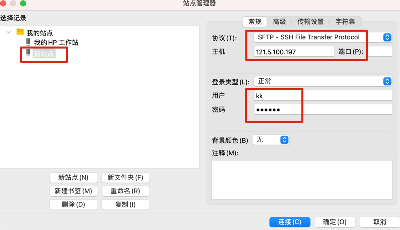

### FTP 配置

安装配置略。

#### Mac 客户端连接

使用 FileZilla，连接如图：



但是如果遇到如下错误：

```shell
错误: 	FATAL ERROR: No supported authentication methods available (server sent: publickey)
错误: 	无法连接到服务器
```

这么处理：

```shell
// 登陆服务器主机
// 修改配置文件  /etc/ssh/sshd_config
sudo vim /etc/ssh/sshd_config

// 将PasswordAuthentication no修改为PasswordAuthentication yes

// 重启ssh服务
sudo systemctl restart sshd.service 
```