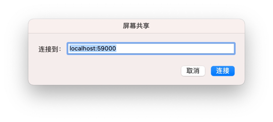
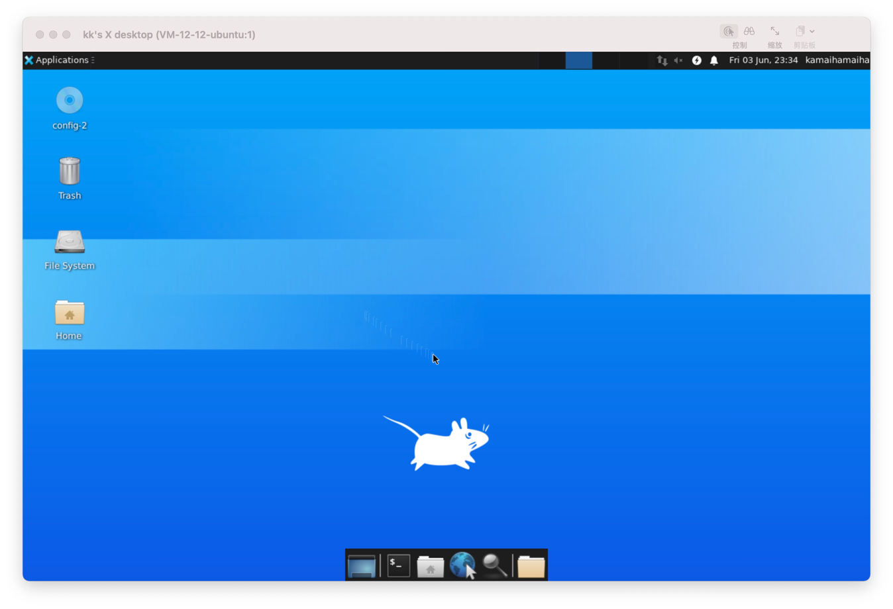

### 安装配置 VNC

- [流程参见](https://www.digitalocean.com/community/tutorials/how-to-install-and-configure-vnc-on-ubuntu-20-04#step-1-installing-the-desktop-environment-and-vnc-server)

注意：要跟着执行到最后，其中 `ssh -L 59000:localhost:5901 -C -N -l sammy your_server_ip` 命令只是建立 ssh 通道，并没有输出结果，不要担心，继续往下操作就可以

#### 使用 vnc viewer 连接

- 先建立 ssh 通道：`ssh -L 59000:localhost:5901 -C -N -l 实际用户名 your_server_ip`
- 打开 VNC Viewer，配置地址为：`localhost:59000`

#### 使用 Mac 的屏幕共享连接

- 先建立 ssh 通道：`ssh -L 59000:localhost:5901 -C -N -l 实际用户名 your_server_ip`
- 打开 屏幕共享

##### 输入密码，该密码是在 Linux 服务器上设置的 vnc 密码

##### 登录成功

    
