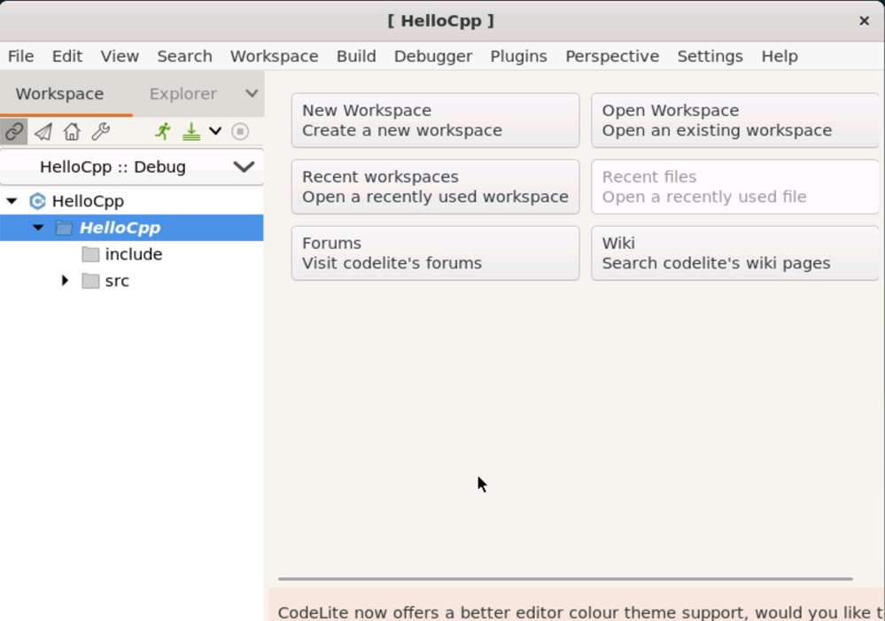
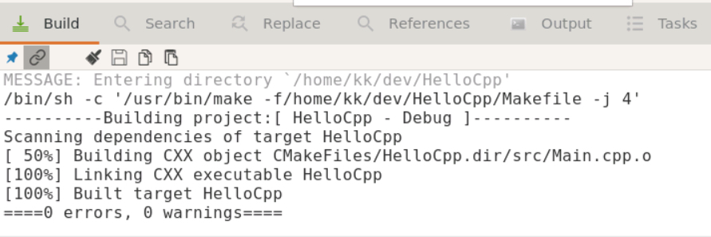
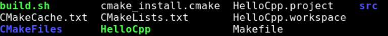
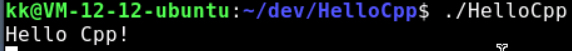

## Linux 上使用 C++

IDE: CodeLite

- 轻量
- 适合学习用

### 安装软件

- 先: `sudo apt-get update`
- 安装 Vim、g++、codelite、cmake: ``sudo apt-get install vim g++ codelite cmake``

### 创建所需文件/文件夹

```shell
~/dev$ mkdir HelloCpp
~/dev$ cd HelloCpp/
~/dev/HelloCpp$ mkdir src
~/dev/HelloCpp$ touch src/Main.cpp
~/dev/HelloCpp$ vim CMakeLists.txt
```

### 编辑 CMakeLists.txt

```cmake
cmake_minimum_required(VERSION 3.5)

project(HelloCpp)

# 编译选项
set(CMAKE_CXX_FLAGS "${CMAKE_CXX_FLAGS} -Wall -Werror -std=c++14")
# 源码目录
set(source_dir "${PROJECT_SOURCE_DIR}/src/")

# 编译哪些文件
file(GLOB source_files "${source_dir}/*.cpp")

# 指明生成的目标可执行文件
add_executable(HelloCpp ${source_files})

```

### 编写脚本（用来执行 CMakeLists.txt）
不是构建项目，而是生成项目文件
```shell
vim build.sh

# 编辑的内容如下
#！/bin/bash

cmake -G "CodeLite - Unix Makefiles" -DCMAKE_BUILD_TYPE=Debug
```

### 执行脚本 build.sh

执行完后，查看当前目录：

```shell
build.sh*
CMakeCache.txt
CMakeFiles/
cmake_install.cmake
CMakeLists.txt
HelloCpp.project 
HelloCpp.workspace
Makefile
src/
```
主要文件是：HelloCpp.project  和 HelloCpp.workspace

### 用 CodeLite 打开项目

在终端中执行：``codelite HelloCpp.workspace``；如果想在后台打开，在后面加上 &：``codelite HelloCpp.workspace &``

如图：   


在 Main.cpp 中编写完代码，保存代码，然后工具栏「Build」选择 「Build Project」，底部输出编译结果：



### 执行编译的可执行程序

回到终端，在项目根目录下，查看文件：



多了一个可执行文件：HelloCpp，执行该文件：



输出结果，就是代码中写的内容！
