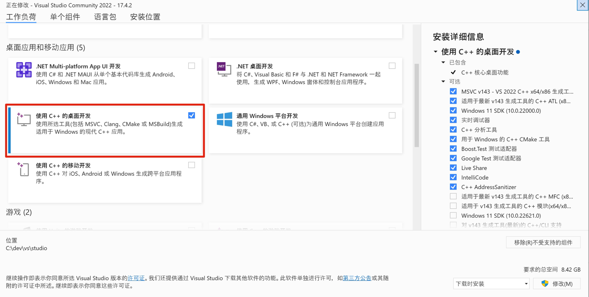
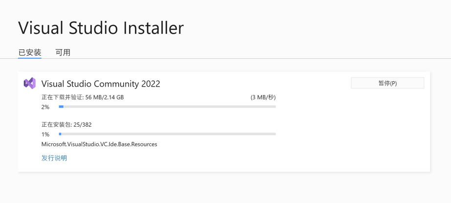
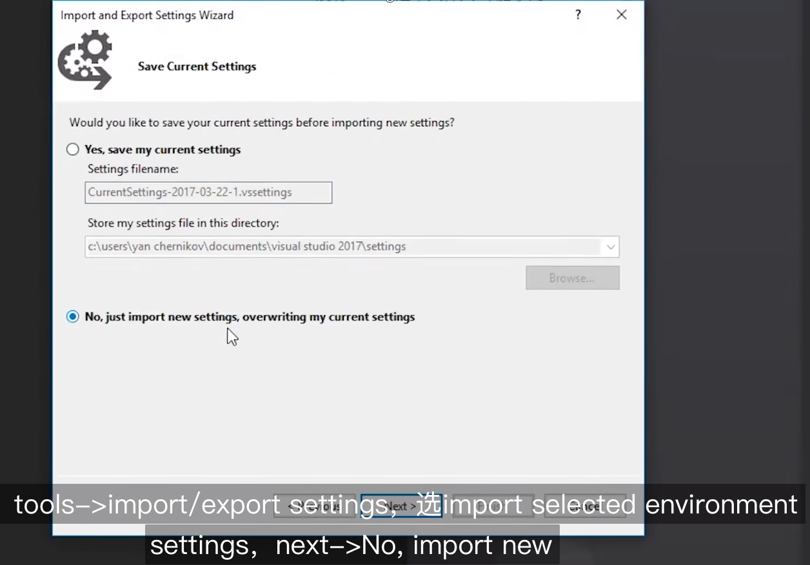
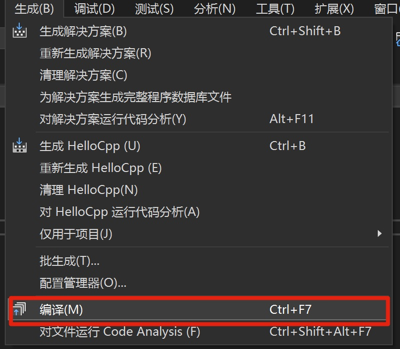
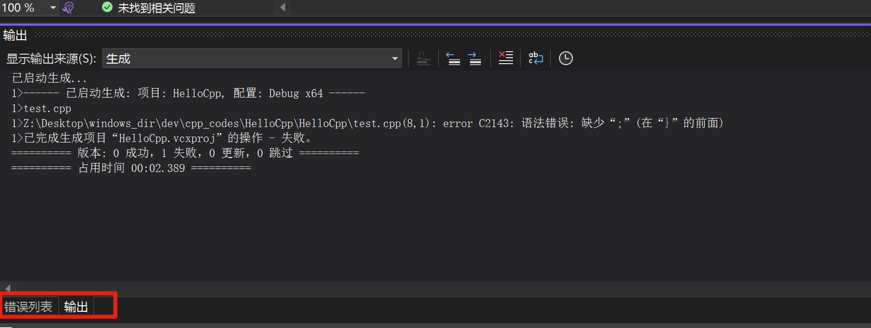

## Windows 上安装 C++

用 Visual Studio

- 推荐插件：Visual Assist
   - 要付费（99$）
   - 提供了很多 vs 缺失的功能

### 选择安装组建

 

只需要安装桌面C++ 就可以了。下载安装需要等一会

### 设置

作者提供了他的设置：[设置文件地址](http://www.thecherno.com/vs)

下载到本地后，可以导入到 VS 中，导入方式：

### solution & project

vs 项目分为 solution 和 project

- solution： 
    - 包含多个相关 project 的集合，
    - 这些 project 可以是不同类型的（dll、exe、lib 等）
    - 是个工作平台
- project
    - 是文件的集合
    - 被编译成某种目标二进制文件（library or executable）

---

### Visual Studio 使用技巧

- 单独编译文件：Ctrl + F7, 或者在「生成」菜单中点击

如果编译错误，底部有「错误列表」和「输出」，建议看「输出」的错误信息，定位问题：
