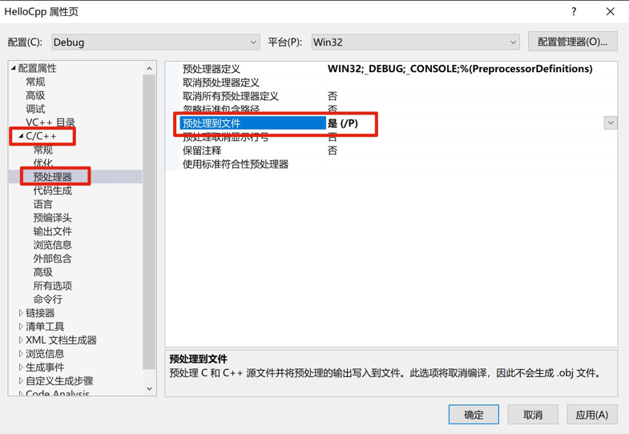
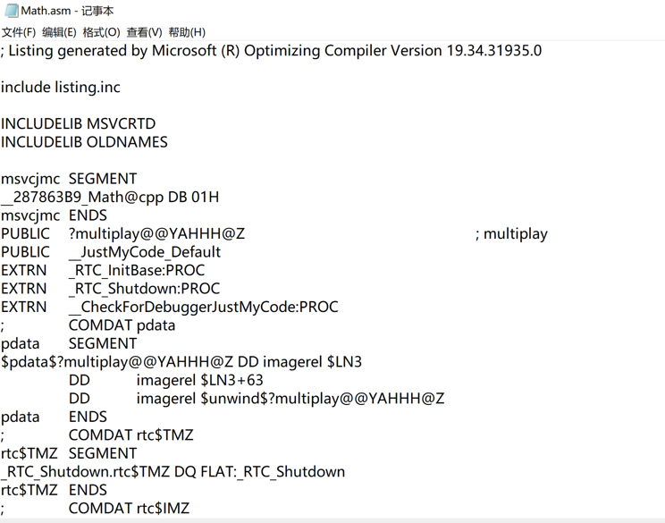
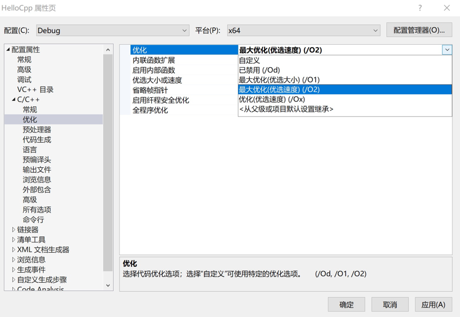
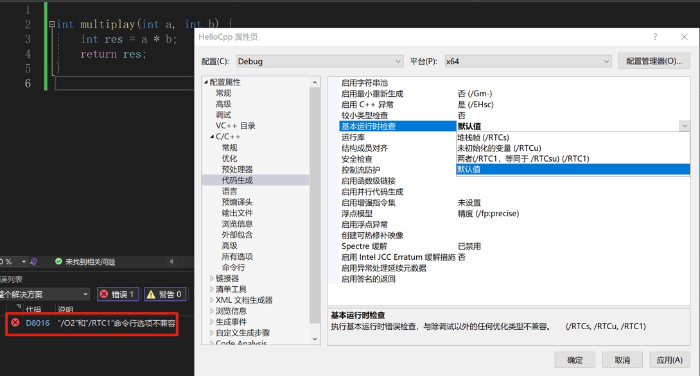

## C++ 编译器如何工作

[视频](https://www.bilibili.com/video/BV1VJ411M7WR?p=6&vd_source=82b7ac2fbd7ece380f983e2c23199d99)

- Compiling

### 编译器的唯一任务就是
 
把文本编程 object 文件   

更具体的就是：

1. pre-process（预处理）
2. tokenizing（标记解释）
3. parsing（解析）

### 关于文件

c++ 看来文件只是用来给编译器提供源码的某种方法

### preprocessing

预编译阶段，在这期间，编译器检查所有 pre-processing 语句并评估，常见的有 include、define、if、ifdef

#### 预编译后生成一个文件

- 预处理文件：.i
- 汇编文件：.asm
- 优化 debug 过程配置
- 函数签名

##### 预处理文件

配置 Visual Studio

右击项目，然后弹出的菜单选择最后一个「属性」，如下选择：

再次单独编译一个 cpp，如 Math.cpp，然后查看编译后生成的文件，就会有 Math.i 文件

##### 汇编文件

配置 Visual Studio

右击项目，然后弹出的菜单选择最后一个「属性」，如下选择：

再次单独编译一个 cpp，如 Math.cpp，然后查看编译后生成的文件，就会有 Math.asm 文件

部分内容如下：

##### 优化 debug 过程配置

然后编译文件，此时会报错，解决如下：

再次编译，生成的汇编文件小了很多

##### 函数签名

编译的文件（从汇编文件可以看出）函数名还有一串随机字符，这是函数的签名。链接器链接不同 object 文件时，需要检查函数签名才可以把他们联系起来

### 附加

- `}`: closing curly brace