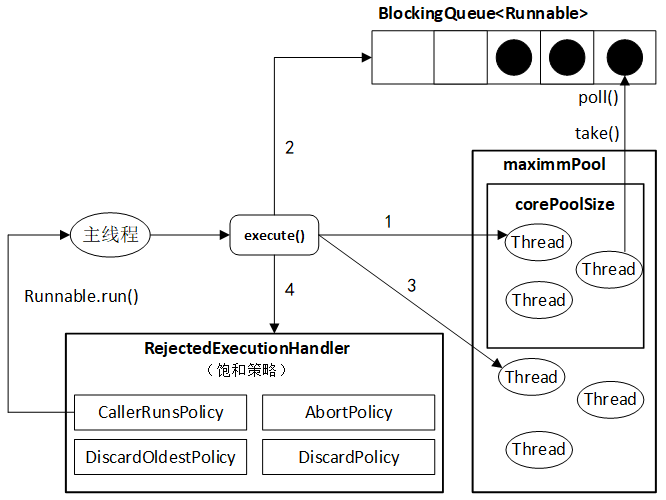

## 线程池

由于线程的创建和销毁都需要一定的开销、线程都是各自为政，很难控制 因此为了更好的对线程进行管理，Java 1.5 引入了 Executor 框架。核心成员：**ThreadPoolExecutor**

**ThreadPoolExecutor** 介绍

- corePoolSize: 核心线程数。默认情况下线程池是空的，只有任务提交时才会创建线程。如果当前运行的线程数少于 corePoolSize，则创建新线程来处理任务，否则不再创建线程
- maximumPoolSize: 最大线程数。如果任务队列满了且线程数小于最大线程数，则线程池会创建新的线程来处理任务
- keepAliveTime: 非核心线程闲置的超时时间
- TimeUnit: 时间单位
- workQueue: 任务队列。如果当前线程数 > corePoolSize，则将任务添加到此任务队列
- threadFactory: 线程工厂，可以用来给每个创建出来的线程设置名字。一般无须设置该参数
- rejectedExecutionHandler: 饱和策略。当线程池和任务队列都满了时采取的应对策略。默认是 AbordPolicy，表示无法处理新任务，并抛出异常
    - 其他三种策略：CallerRunsPolicy、DiscardPolicy、DiscardOldestPolicy

### 线程池的种类

通过直接或者简介配置 ThreadPoolExecutor 的参数可以创建不同类型的线程池：FixedThreadPool、CachedThreadPool、SingleThreadPool、ScheduledThreadPool。

##### FixedThreadPool
可重用固定线程数的线程池。

- 只有核心线程数，且数量固定
- 没有非核心线程
- 任务队列是：LinkedBlockingQueue，容量默认 Integer.MAX_VALUE

##### CachedThreadPool

根据需要创建线程的线程池

- corePoolSize = 0
- maximumPoolSize = Integer.MAX_VALUE
- keepAliveTime = 60
- TimeUnit = TimeUnit.SECONDS
- workQueue = SynchronousQueue: 不存储元素的阻塞队列，每个插入操作必须等待另一个线程的移除操作，同样任何一个移除操作都等待另一个线程的插入操作

每次提交任务都会立刻有线程执行，比较适合大量需要立刻处理并且耗时较少的任务。

##### SingleThreadPool

单个工作线程的线程池。

确保所有任务在一个线程中按照顺序逐一实行。

##### ScheduledThreadPool

能够实现定时和周期任务的线程池