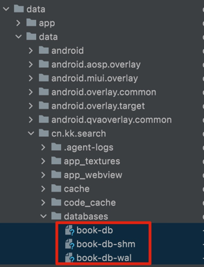

### 数据库

书籍信息逐步转移到数据库 sqlite 中。

#### Room 方式创建数据库

- [代码](../../../app/src/main/java/cn/kk/io/db)
- 
- Mac 上使用 SqliteStudio 打开，注意三个文件都要复制出来
    - [SqliteStudio 下载地址](https://github.com/pawelsalawa/sqlitestudio/releases/)
- appCompileSdkVersion 改成 31或者更大才可以
- Room 的依赖放到 app 下的 build.gradle 中，假如放到 base module gradle 脚本会报错

#### 数据库结构说明
- book 表
- chapter 表
- section 表

#### book 表

- book_id
- book_name
- book_img_res

#### chapter 表

- book_id
- chapter_id
- chapter_title
- chapter_order

#### section 表

- book_id
- chapter_id
- section_id
- section_title
- section_order
- finish_tag

