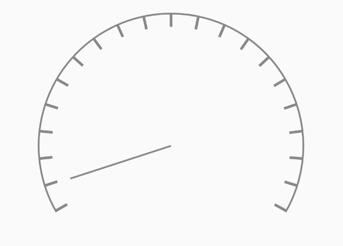
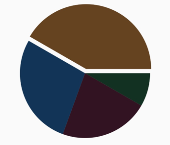

### 图形的位置和尺寸测量

#### 代码

- [SimpleView.kt](../../hencoder/src/main/java/com/example/hencoder/draw/SimpleView.kt)

#### 绘制的基本要素

- onDraw(Canvas)
- Canvas: 实际绘制工具
- Paint: 调整风格
- 坐标系
- 尺寸单位：px

---

#### 效果

##### [`DashBoardView.kt`](../../hencoder/src/main/java/com/example/hencoder/draw/DashBoardView.kt)

##### [`PieView.kt`](../../hencoder/src/main/java/com/example/hencoder/draw/PieView.kt)

