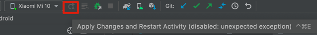
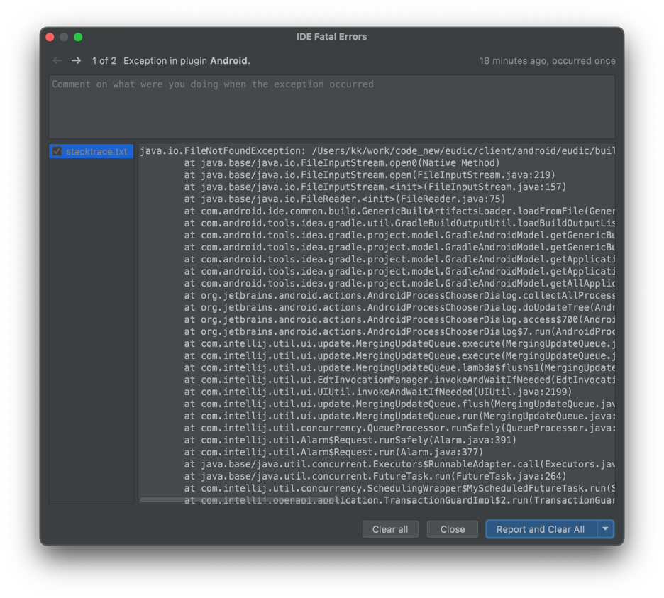
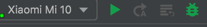

## Run 按钮灰色了

如图:   

- 尝试 「File」-> 「Invalidate Caches...」不行
- 看到工具栏的 「Attach Debugger」还能点，于是点击，
   
失败后右下角弹出如下: 

根据提示，点击蓝色的 「See detail and submit report」，弹出错误详情:
   
说是在 一个 module 下的 build 的一个路径下面，找不到文件。干脆直接删除 build 文件夹：`rm -r build`，此时工具栏上的 Run 按钮可以点击了：   
