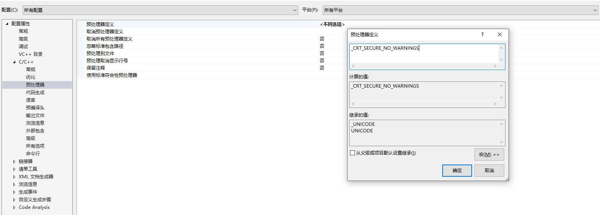

## Visual Studio 使用笔记

- [快捷键](#快捷键)
- [cpp 项目最好的配置](./cpp_setup.md)
- [安全警告问题](#安全警告问题)

### 快捷键

- [注释](#注释)
- [打开微软官方的在线 API 文档](./ms_online_api_document.md)

#### 注释

- 注释：`ctrl + k / ctrl + c`
- 取消注释：`ctrl + k / ctrl + u`

查看方式：编辑 -> 高级 -> 注释选定内容

### 安全警告问题

设置当前 solution，如下，添加一个宏：
