## vscode 调试 C/C++ 代码

### 步骤

- 创建编译任务并执行
- 创建 launch

#### 创建编译任务
[代码目录](./demo/)
简单的代码如下：
```c
#include <stdio.h>


int main(){

    printf("Hello C!\n");
    return 0;
}
```

顶部菜单栏，选择配置任务：
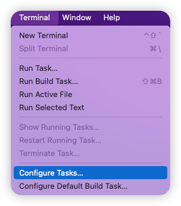

命令面板中根据电脑的实际情况选择，这里 Mac 下是用的 clang 编译器，因此选择第一个，如果是 Linux 则选择第二个 gcc

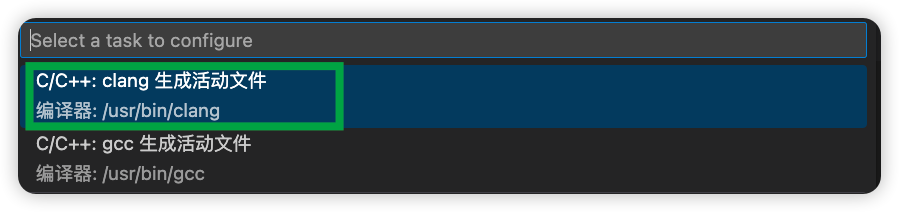
点击后，会在创建一个 task.json 文件，位置如下：
```shell
.vscode
└── tasks.json
```
默认内容如下：
```json
{
	"version": "2.0.0",
	"tasks": [
		{
			"type": "cppbuild",
			"label": "C/C++: clang 生成活动文件", 
			"command": "/usr/bin/clang",
			"args": [
				"-fcolor-diagnostics",
				"-fansi-escape-codes",
				"-g",
				"${file}",
				"-o",
				"${fileDirname}/${fileBasenameNoExtension}"
			],
			"options": {
				"cwd": "${fileDirname}"
			},
			"problemMatcher": [
				"$gcc"
			],
			"group": "build",
			"detail": "编译器: /usr/bin/clang"
		}
	]
}
```

重要的三个参数：type、command、args。

根据实际需要修改后，保存然后回到 C源代码文件退出。

#### 执行刚才创建的编译任务

mac 下有的会执行编译任务失败，可用命令行编译或者脚本编译替代。

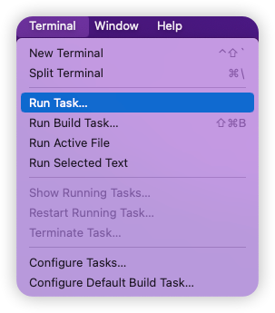
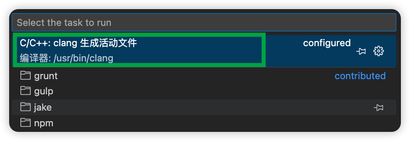

然后 Terminal 中如下：
```text
 *  Executing task: C/C++: clang 生成活动文件 

正在启动生成...
/usr/bin/clang -fcolor-diagnostics -fansi-escape-codes -g /Users/kk/dev/code/DevNotes/doc/ide/visual_studio_code/debug_c_or_cpp/demo/main.c -o /Users/kk/dev/code/DevNotes/doc/ide/visual_studio_code/debug_c_or_cpp/demo/main

生成已成功完成。
 *  Terminal will be reused by tasks, press any key to close it. 
```
然后生成了 `main` 可执行文件：
```text
.
├── main
├── main.c
└── main.dSYM
```

### 调试

点击调试按钮，如下：    
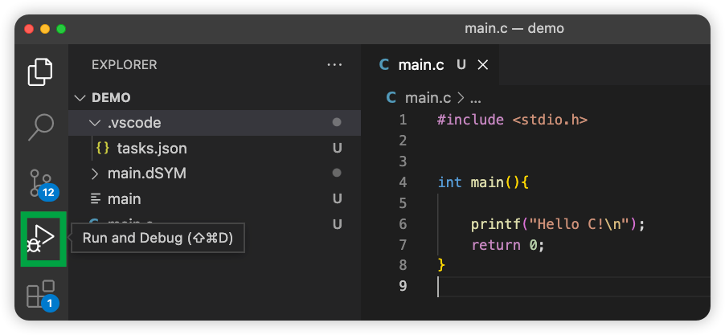
然后点击按钮：   
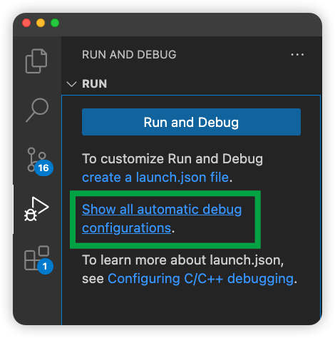

点击第二个，添加配置（别忘记打断点）：
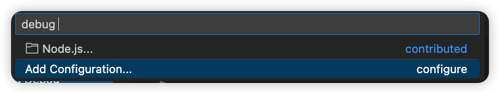

然后创建了 launch.json，如下：
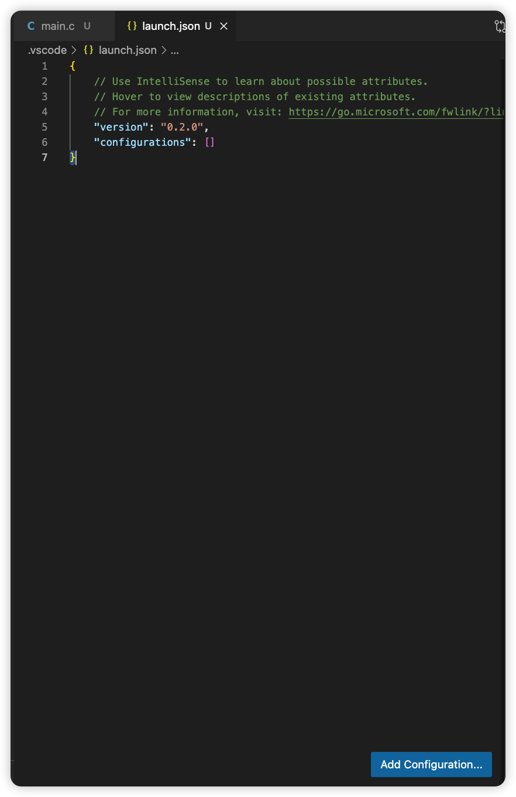

添加调试配置，点击上图右下角的按钮：Add Configuration...

弹出的框中，选择第一个：
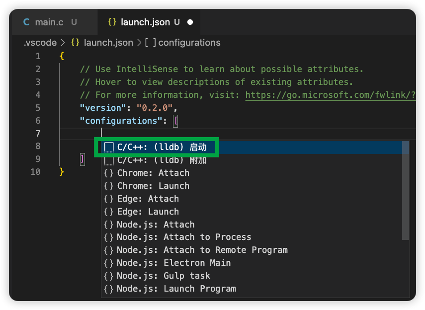

如图，添加了默认配置：
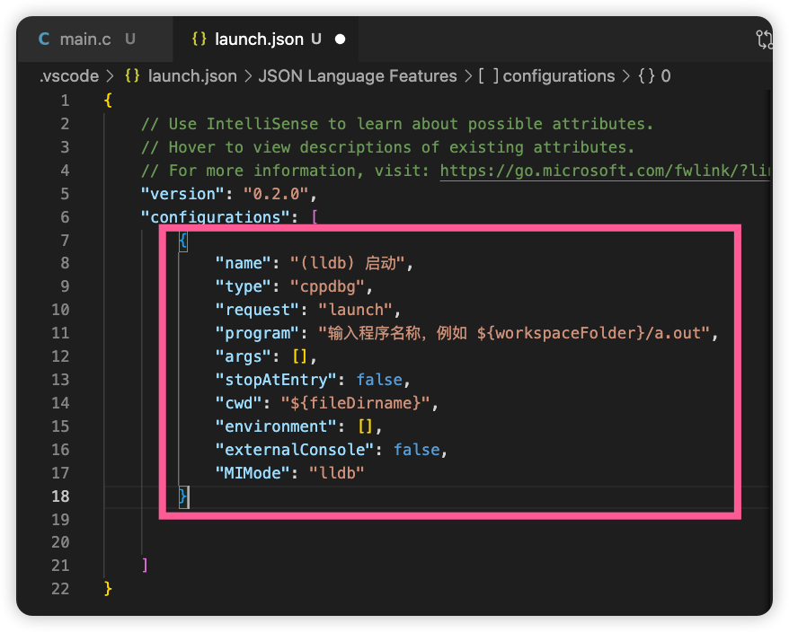

根据实际情况修改后，如图：
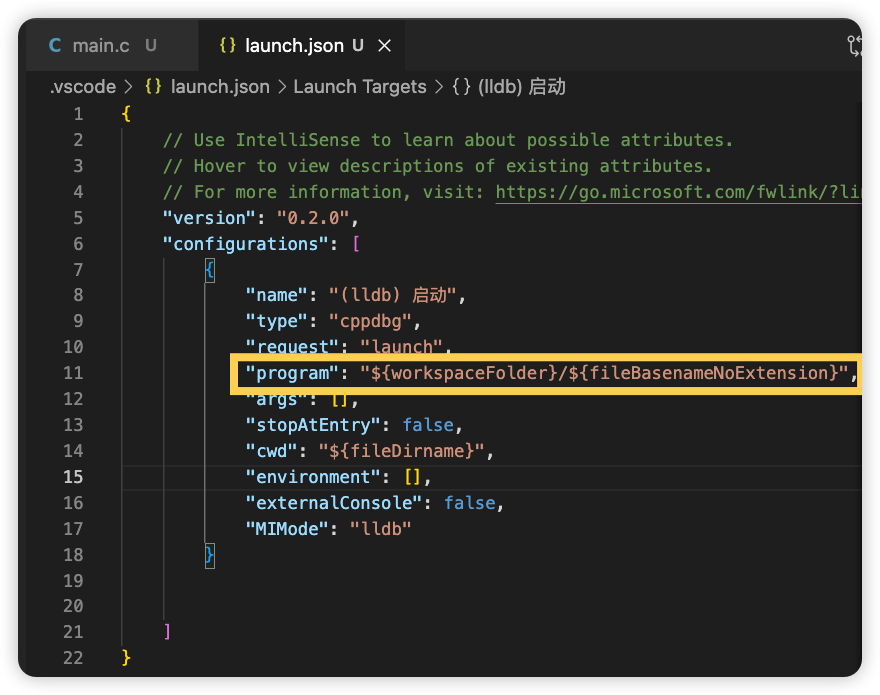

保存后，回到 C源代码文件，点击左侧的 debug 按钮，


点击上图上面绿色的按钮，开始 debug

如下，走到了断点的位置：
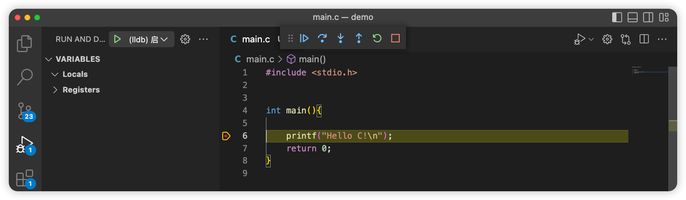


