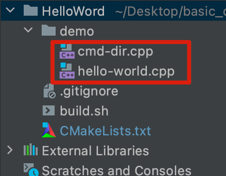

## 多个源文件构建

step0: 如图，有两个源文件，都有 main 函数


step1: CMake 内容如下：
```cmake
cmake_minimum_required(VERSION 3.5 FATAL_ERROR)

project(Hello LANGUAGES CXX)


set(demo_dir ${PROJECT_SOURCE_DIR}/demo)
file(GLOB demo_codes ${demo_dir}/*.cpp)

foreach(code_file ${demo_codes})
    # 将 cpp 文件的全路径转成 文件名
    string(REGEX MATCH "[^/]+$" demo_file ${code_file}) 
    message("code_file:" ${code_file} ",demo_file:"${demo_file})
    # 将 cpp 文件名转成 没有扩展名的文件名，作为下一步可执行程序名
    string(REPLACE ".cpp" "" demo_basename ${demo_file})
    message("demo_basename:" ${demo_basename})
    add_executable(${demo_basename} ${code_file})
    
endforeach()
```

step2: 然后，在项目根目录下，编写构建脚本（build.sh）：
```shell
#!/bin/zsh

rm -rf output # clear temp dir
mkdir output
cd output

cmake .. # 在临时目录中创建工程
make
./hello-world
./cmd-dir
```

给 build.sh 加上执行权限：`chmod +x build.sh`

step3: 执行脚本
执行前项目文件结构：
```text
├── CMakeLists.txt
├── build.sh
└── demo
    ├── cmd-dir.cpp
    └── hello-world.cpp

```
```shell
./builld.sh

# 输出如下（部分省略）
CMake Warning (dev) in CMakeLists.txt:
  Syntax Warning in cmake code at

    /Users/kk/Desktop/basic_dev_codes/CMakeDemo/HelloWord/CMakeLists.txt:12:52

  Argument not separated from preceding token by whitespace.
This warning is for project developers.  Use -Wno-dev to suppress it.

-- The CXX compiler identification is AppleClang 13.1.6.13160021
-- Check for working CXX compiler: /Library/Developer/CommandLineTools/usr/bin/c++
-- Check for working CXX compiler: /Library/Developer/CommandLineTools/usr/bin/c++ -- works
-- Detecting CXX compiler ABI info
-- Detecting CXX compiler ABI info - done
-- Detecting CXX compile features
-- Detecting CXX compile features - done
code_file:/Users/kk/Desktop/basic_dev_codes/CMakeDemo/HelloWord/demo/cmd-dir.cpp,demo_file:cmd-dir.cpp
demo_basename:cmd-dir
code_file:/Users/kk/Desktop/basic_dev_codes/CMakeDemo/HelloWord/demo/hello-world.cpp,demo_file:hello-world.cpp
demo_basename:hello-world
-- Configuring done
-- Generating done
-- Build files have been written to: /Users/kk/Desktop/basic_dev_codes/CMakeDemo/HelloWord/output
Scanning dependencies of target hello-world
[ 25%] Building CXX object CMakeFiles/hello-world.dir/demo/hello-world.cpp.o
[ 50%] Linking CXX executable hello-world
[ 50%] Built target hello-world
Scanning dependencies of target cmd-dir
[ 75%] Building CXX object CMakeFiles/cmd-dir.dir/demo/cmd-dir.cpp.o
[100%] Linking CXX executable cmd-dir
[100%] Built target cmd-dir
Hello CMake!
This is cmd-dir:
```

执行后项目文件结构：
```text
├── CMakeLists.txt
├── build.sh
├── demo
│   ├── cmd-dir.cpp
│   └── hello-world.cpp
└── output
    ├── CMakeCache.txt
    ├── CMakeFiles
    ├── Makefile
    ├── cmake_install.cmake
    ├── cmd-dir
    └── hello-world

```
