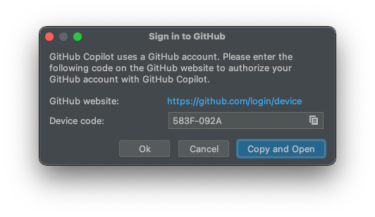
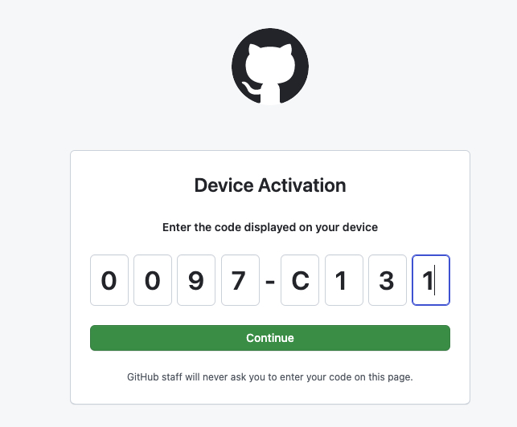
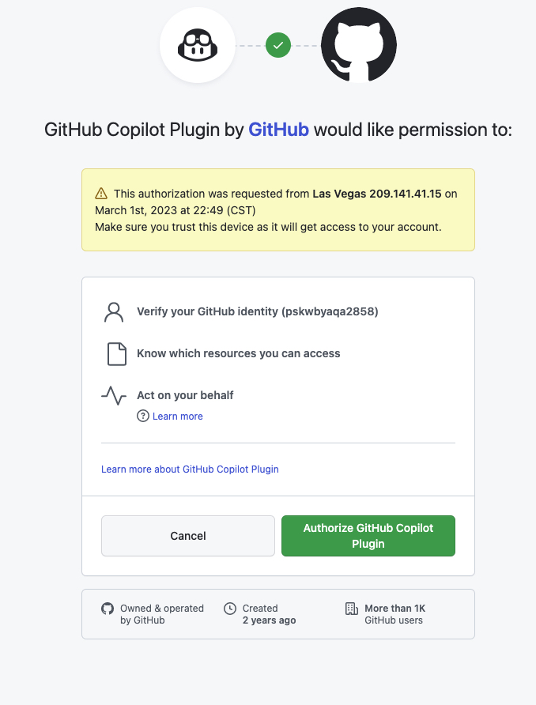

## GitHub Copilot

- AI 编程助手
- [官网]
- 需要付费

### 淘宝买（28¥）的 GitHub 学生包

- 账号：pskwbyaqa2858
- pwd:
- 邮箱: rbnrmnqw@hotmail.com 
- 密码


### 然后在自己的 IDE 中安装 Copilot 插件

- 如在 Android studio 中
- 安装后，重启 IDE
- 右下角
  
- 点击后，弹窗如下：
  
- 根据提示，下一步操作：
  
- 根据提示，下一步操作：
  
  - 根据提示，下一步操作：   
  

#### 测试一下
在 kt 类中，输入注释，回车后，即给出下面的代码建议
```kotlin
// get device id
val deviceId = Settings.Secure.getString(contentResolver, Settings.Secure.ANDROID_ID)
```