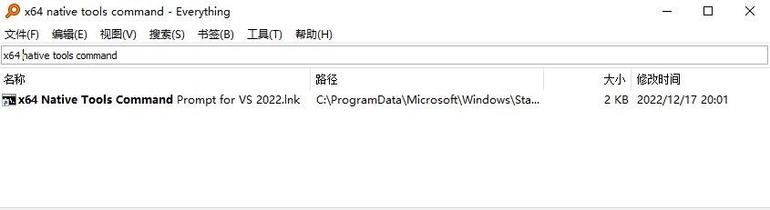
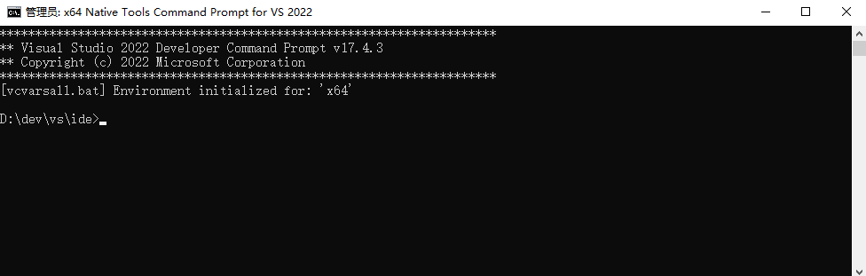
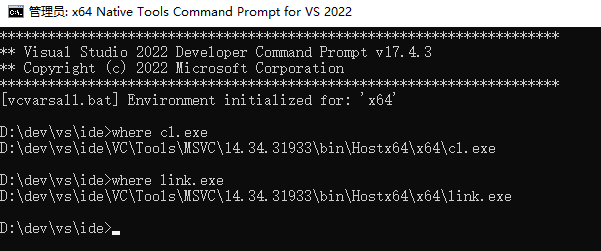

## C++编译环境 MSVC

MSVC 是 windows 比较早期的编译工具链，这个工具链主要有 两个软件， cl.exe （编译器） 跟 link.exe（链接器）。

cl.exe 和 link.exe T通常集成在 Visual studio 中了，菜单栏 -> 工具 -> 获取工具和功能(T).. 

安装后，要找到：**x64 Native Tools Command Prompt for VS 2022**，如下：

然后打开，如下：

使用 **where** 查询 cl.exe 和 link.exe，如下：

为了使用方便，可以配置到环境变量中。