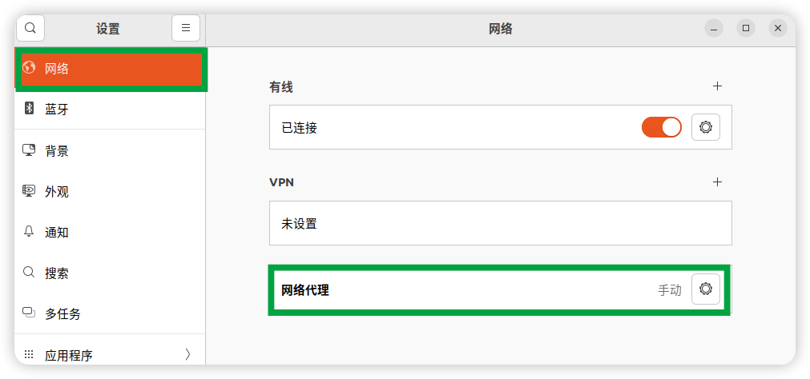
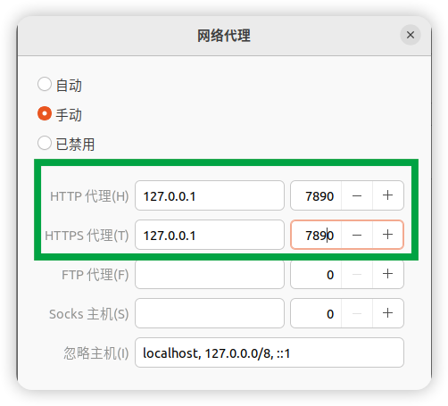

### Ubuntu 使用

- ShellClash
- 中文输入法
- 进入 root 用户
- [Ubuntu 包搜索网站](https://packages.ubuntu.com/)
- [恢复默认镜像源](https://www.linuxshelltips.com/restore-default-repositories-in-ubuntu/)
- 镜像源文件路径：`/etc/apt/sources.list`
- [安装 Android Studio](https://linuxhint.com/install-android-studio-ubuntu22-04/)
- [梯子工具 class for windows](https://github.com/Fndroid/clash_for_windows_pkg/releases)
  - 是跨平台的，不是给 Windows 系统专用的，是窗口（Window）版
  - [使用说明](https://github.com/cybery2019/clashforwindows-)
  - 注意 Ubuntu 网络设置 VPN 开启，设置如下：
    
    

#### ShellClash

由于 clash-linux 安装各种坑，放弃。该用 ShellClash

#### 进入 root 用户

``sudo -i``

#### 中文输入法

安装的谷歌拼音输入法。坑死了。

- [安装过程](https://mrzhubin.wordpress.com/2019/09/20/install-google-pinyin-input-method-on-debian/)
  - 注意里面的第四步配置完后，不是 reboot the server，而是重启电脑。然后就可以用输入法了。

我的环境开始一直安装失败，提示定位不到包。解决办法就是换镜像源。

##### 换镜像源

不需要用繁琐的命令替换，直接 Ubuntu dash 搜索 `Software & Updates`

打开后，在 Tab: **Ubuntu Software** 下，Download from 右面的选择框，选择镜像源。点击 「Other...」-> 「China」 里面选一个，   
然后点击右下角的 「Choose Server」，最后关闭当前窗口，会弹窗提示，选择 「Reload」, 重新加载完。再打开终端，输入安装命令，如果   
还是不行，那重复刚才步骤，再换个镜像源。

#### 安装 Android Studio

