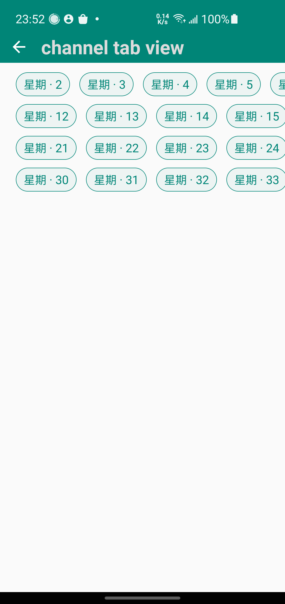

## 自定义控件入门

- [绘图基础](./docs/chapter1/readme.md)
- [动画篇](./docs/chapter_anim/readme.md)
- [绘图篇](./docs/chapter_draw_view/readme.md)  
- [视图篇](./docs/chapter_views/readme.md)  

---

### 《Android 开发艺术探索》

- [View 的事件体系](./docs/dev_art/part_1.md)
- [View 的工作原理](./docs/dev_art/part_2.md)

### 工作中开发的自定义 view

- 流式布局，可指定行数
  - 外部嵌套 HorizontalScrollView，可左右滚动
  

