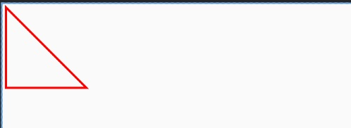

## Path 

### 直线
 - [BasicArcView](../../src/main/java/cn/kk/elementary/chapter1/path/BasicTriangleView.kt)
    
### 弧线
 - [BasicArcView](../../src/main/java/cn/kk/elementary/chapter1/path/BasicArcView.kt)

 ### 

