## 约束布局

### 要点

1. 至少要 2 个约束，一个水平方向，一个垂直方向
2. 0dp 就是 match constraint 充满约束的意思
3. 以某个位置居中，如下效果：   
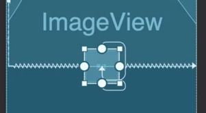
   ```xml
    layout_constraintTop_toBottomOf="@+id/xxx"
    layout_constraintBottom_toBottomOf="@+id/xxx"
   ```
   
4. 权重：layout_constraintHorizontal_weight & layout_constraintVertical_weight
5. 基准线对齐：Baseline_toBaselineOf   
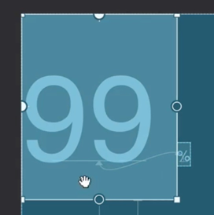
   
6. 角度定位(从正上方开始计算角度)
   - 圆心: Circle
   - 半径: CircleRadius
   - 角度: CircleAngle

7. 里面的 view 更依赖于 子控件 相互关系
8. 约束住宽度：constrainedWidth=true   
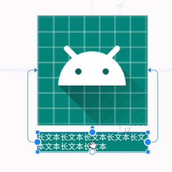
9. 如下效果：   

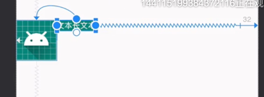
```xml
layout_width="wrap_content"
layout_constraintEnd-toEndOf="parent"
layout_constraintStart-toStartOf="@+id/avatar"
layout_marginEnd="32dp"
app:layout_constrainedWidth="true"
app:layout_constraintHorizontal_bias="0.0"
```
10. goneMarginStart
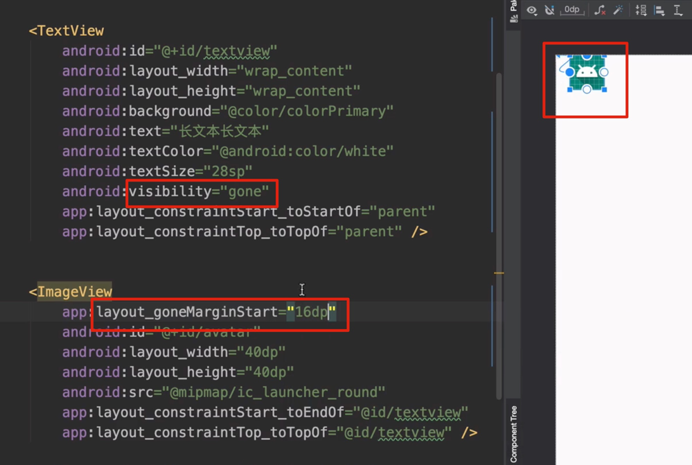
    
11. layout_constraintVertical_chainStyle 
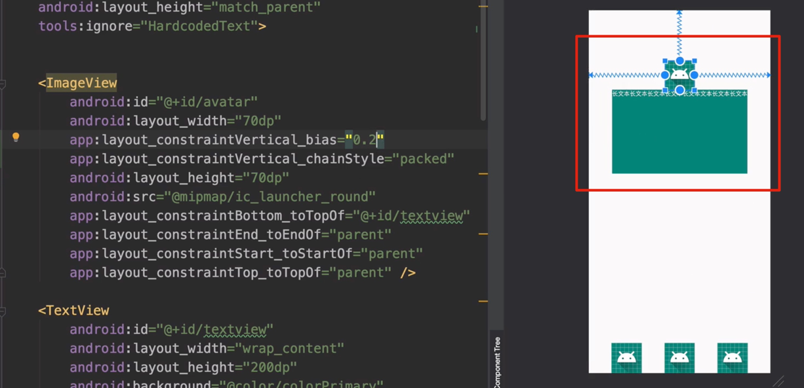
    
12. layout_constraintHorizontal_chainStyle    
value="spread_inside"   
   

    
13. 宽高比例（layout_constraintDimensionRatio）   
前提是，宽和高至少一个设置为 0dp。
    
```xml
layout_constraintDimensionRatio="2:3"
```
如果宽和高都是 0dp，那么需要指定谁是计算出来的的：   
高度是计算出来的，宽度是充满约束的。
```xml
layout_constraintDimensionRatio="H,2:3"
```
14. 百分比布局(layout_constraintWidth_percent)    
- 对应的宽 layout_width 要设置为 0dp
- 百分比是相对于父容器的

15. Guideline   
- layout_constraintGuide_percent 还支持负数
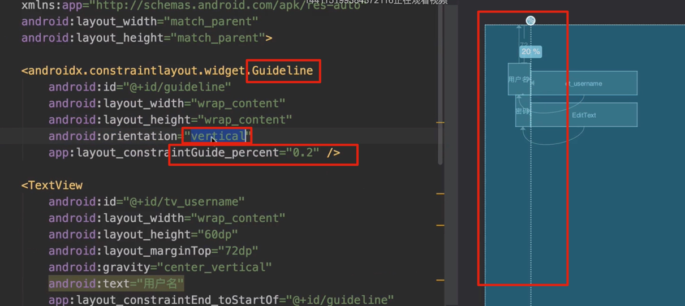  
  
- Guide_end   
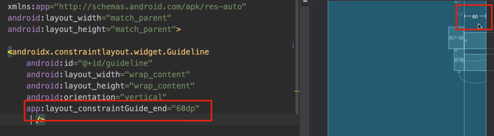   
  
16. Group
可以实现一起操作的效果：   
    
    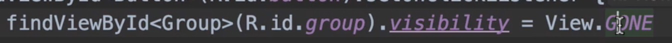
    
18. Layer
    可以实现一起操作的效果：
    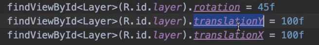
    
19. Barrier   
- 注意有的特殊混淆工具会把引用的 view id 混淆，导致到不到 view 了
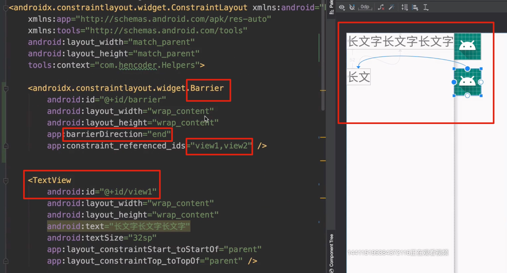   
  
20. Placeholder
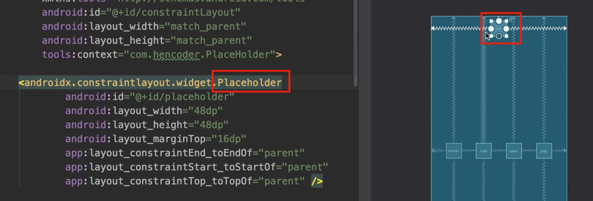   
在 代码中可以指定某个 view 替换到 placeholder 上面：
   
    
21. 在 Java/Kotlin 动态约束
```kotlin
val view: View = View(context)
val constraintLayout = view as ConstraintLayout
val constraintSet = ConstraintSet().apply {
    clone(constraintLayout)
    connect(
        R.id.xxx,
        ConstraintSet.BOTTOM,
        ConstraintSet.PARENT_ID,
        ConstraintSet.BOTTOM
    )
}
```
22. 自定义 Helper

- [代码， 但是不知道如何用](../elementary/src/main/java/cn/kk/elementary/constraint/Linear.kt)
    
    
23. Flow   
- 如果要加间隔，用属性：app:flow_verticalGap
- 排列风格，用属性：app:flow_wrapMode
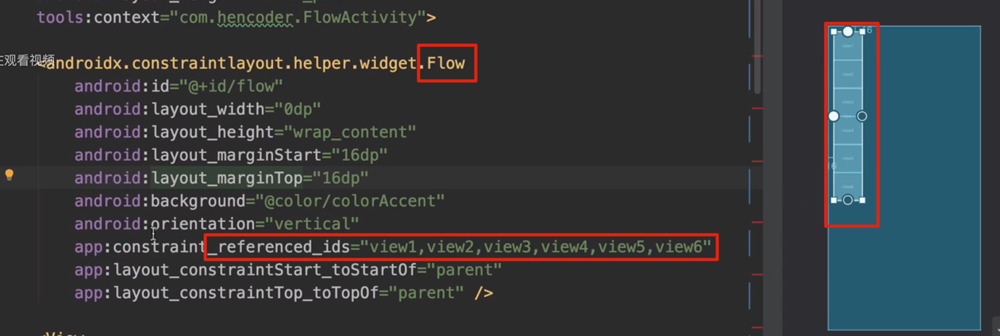   

24. 代码中获取约束布局的整个约束集合
constraintSet.clone(context, layoutId)。如下，可进行布局替换：
   
    
    


